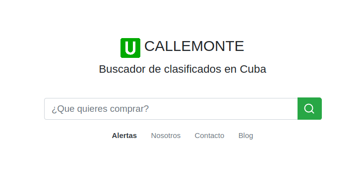

# Callemonte



Callemonte es un meta buscador de clasificados en los sitios dedicados a publicarlos para Cuba. Esta desarrollado con Nuxt y TailwindCSS y utiliza las funciones de netlify para el back.

## Build Setup

``` bash
# install dependencies
$ npm install

# install Ntelify Dev
$ npm install

# serve with hot reload at localhost:8888
$ netlify dev
```
Con esto debe ser suficiente para correr callemonte localmente. 

Callemonte está pensado para todos los cubanos así que cualquiera puede mejorarlo solo envia un PR.
